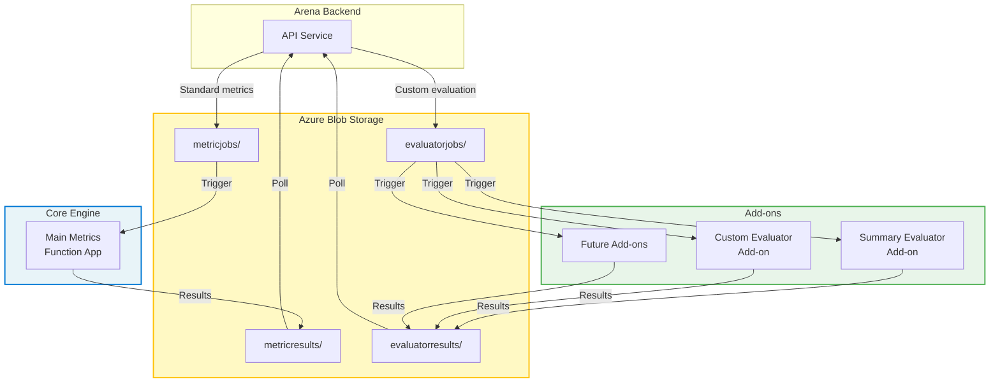
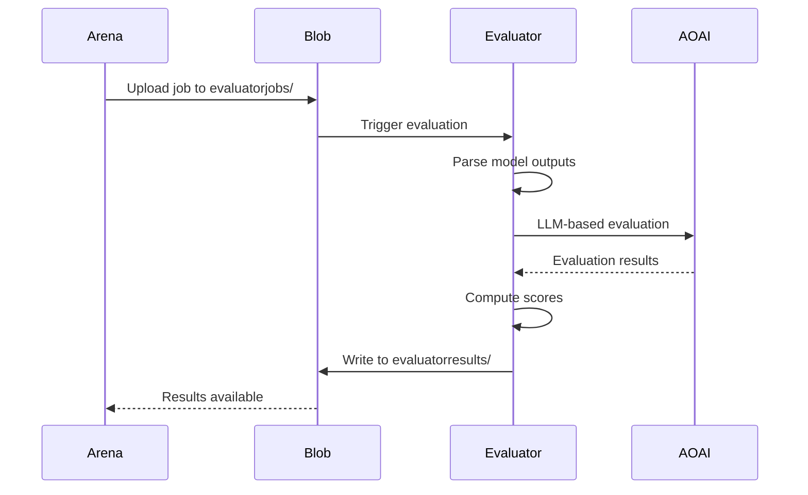
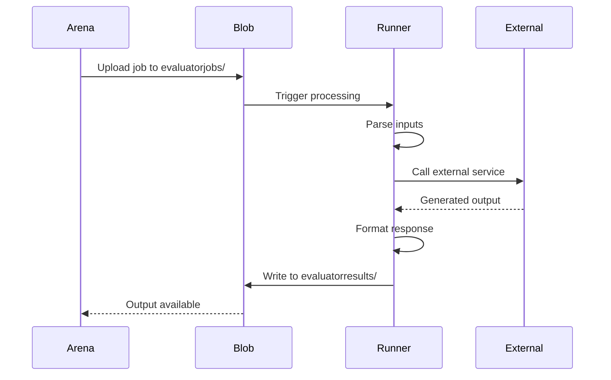

# Custom Evaluation Add-ons

Healthcare AI Model Evaluator supports extensible evaluation capabilities through add-ons: specialized function apps that provide custom metrics, domain-specific assessments, and advanced evaluation workflows beyond the standard metrics engine.

## Overview

Add-ons extend the Healthcare AI Model Evaluator platform in two primary ways:

1. **Evaluators**: Specialized assessors that score and analyze existing model outputs
2. **Function App Runners**: External processors that generate model outputs through Azure Functions

Both addon types integrate seamlessly with the Arena platform while maintaining independence from the core metrics engine, enabling modular development and deployment of custom evaluation capabilities.

## Add-on Architecture

### Core Principles

**Independence**: Each add-on operates as a separate Azure Function App with dedicated blob containers, allowing isolated scaling, deployment, and failure handling.

**Standardization**: All add-ons follow consistent patterns for input/output formats, blob storage integration, and result reporting.

**Discoverability**: Arena automatically discovers add-on results through naming conventions and blob container patterns.

**Extensibility**: New add-ons can be developed and deployed without modifying the core platform.

### Integration Pattern



### Container Isolation

Add-ons use dedicated blob containers separate from the main metrics engine:

| Component | Input Container | Output Container | Naming Pattern |
|-----------|----------------|------------------|----------------|
| Main Metrics | `metricjobs/` | `metricresults/` | `{job-name}-results.json` |
| Evaluator Add-ons | `evaluatorjobs/` | `evaluatorresults/` | `{job-name}-{addon-name}-results.json` |

**Benefits**:
- Clear separation of concerns
- Independent processing pipelines
- Isolated failure domains
- Simplified monitoring and debugging

## Add-on Types

### 1. Evaluators

Evaluators assess and score existing model outputs using specialized metrics or domain expertise.

**When to Use**:
- Domain-specific evaluation criteria (clinical guidelines, medical standards)
- Model-as-judge workflows using LLMs
- Complex scoring that requires multi-stage processing
- Custom metrics not available in standard engine

**Example Use Cases**:
- Medical report quality assessment using clinical criteria
- Summarization evaluation with question-based methodology
- Compliance checking against medical coding standards
- Multi-dimensional clinical relevance scoring

**Processing Flow**:


### 2. Function App Runners

Function App Runners generate model outputs through external processing rather than evaluating existing outputs.

**When to Use**:
- Integration with external AI services or models
- Complex multimodal processing pipelines
- Specialized inference workflows not supported by standard connectors
- External systems that require custom API interactions

**Example Use Cases**:
- Medical image analysis requiring specialized preprocessing
- Multi-stage generation pipelines with intermediate validation
- Integration with proprietary medical AI systems
- Custom RAG implementations with domain-specific retrieval

**Processing Flow**:


**Key Difference**: Function App Runners return `{"output": "..."}` containing generated content, while Evaluators return `{"metrics": {...}}` containing scores and assessments.

## Creating Custom Add-ons

### Step 1: Define Your Add-on

**Decision Tree**:

```
Do you need to generate new model outputs?
├─ Yes → Create Function App Runner
│   └─ Returns: {"output": "generated text"}
└─ No → Create Evaluator
    └─ Returns: {"metrics": {...}}

Does it require LLM calls?
├─ Yes → Add Azure OpenAI integration
└─ No → Use local processing only

Do you need multimodal inputs?
├─ Yes → Parse both text and image fields
└─ No → Parse text only
```

### Step 2: Directory Structure

Create your add-on directory following the standard pattern:

```
functions/addons/
└── your-addon/
    ├── function_app.py          # Azure Function entry point
    ├── host.json               # Function app configuration
    ├── requirements.txt        # Python dependencies
    ├── local.settings.json     # Local development settings
    ├── your_addon.py          # Core evaluation logic
    └── README.md              # Add-on documentation
```

### Step 3: Implement Blob Trigger

**Basic Template**:

```python
import azure.functions as func
import json
import logging
from typing import Dict, Any

app = func.FunctionApp()

@app.blob_trigger(
    arg_name="blob",
    path="evaluatorjobs/{name}",
    connection="AzureWebJobsStorage"
)
def your_addon_trigger(blob: func.InputStream) -> None:
    """
    Processes evaluation jobs from evaluatorjobs/ container.
    """
    logging.info(f"Processing blob: {blob.name}")
    
    try:
        # Parse input
        job_data = json.loads(blob.read().decode('utf-8'))
        
        # Process based on add-on type
        if is_evaluator:
            results = evaluate_outputs(job_data)
        else:  # Function App Runner
            results = generate_outputs(job_data)
        
        # Write results
        write_results_to_blob(blob.name, results)
        
    except Exception as e:
        logging.error(f"Error processing {blob.name}: {str(e)}")
        write_error_to_blob(blob.name, str(e))

@app.route(route="health", methods=["GET"])
def health_check(req: func.HttpRequest) -> func.HttpResponse:
    """Health check endpoint for monitoring."""
    return func.HttpResponse("Healthy", status_code=200)
```

### Step 4: Parse Input Data

**Standard Input Schema**:

```python
def parse_job_data(job_data: Dict[str, Any]) -> Dict[str, Any]:
    """
    Parses standardized job input.
    
    Expected structure:
    {
      "model_run": {
        "dataset": {
          "instances": [...]
        },
        "results": [...]
      },
      "metrics_type": "summarization",
      "base_prompt": "...",
      "output_instructions": "..."
    }
    """
    model_run = job_data.get("model_run", {})
    instances = model_run.get("dataset", {}).get("instances", [])
    results = model_run.get("results", [])
    
    # Extract relevant fields
    evaluations = []
    for instance, result in zip(instances, results):
        evaluation = {
            "instance_id": instance.get("id"),
            "input": instance.get("input", {}),
            "reference": instance.get("references", [{}])[0].get("output", {}),
            "generated": result.get("completions", {})
        }
        evaluations.append(evaluation)
    
    return {
        "evaluations": evaluations,
        "metrics_type": job_data.get("metrics_type"),
        "base_prompt": job_data.get("base_prompt"),
        "output_instructions": job_data.get("output_instructions")
    }
```

### Step 5: Implement Evaluation Logic

**Evaluator Example**:

```python
from typing import List, Dict, Any
import logging

def evaluate_outputs(job_data: Dict[str, Any]) -> Dict[str, Any]:
    """
    Evaluates model outputs against criteria.
    """
    parsed = parse_job_data(job_data)
    results = []
    
    for eval_item in parsed["evaluations"]:
        instance_id = eval_item["instance_id"]
        reference_text = eval_item["reference"].get("text", "")
        generated_text = eval_item["generated"].get("text", "")
        
        # Perform evaluation
        score = compute_custom_metric(reference_text, generated_text)
        
        results.append({
            "instance_id": instance_id,
            "metrics": {
                "custom_score": score,
                "details": {
                    "reference_length": len(reference_text),
                    "generated_length": len(generated_text)
                }
            }
        })
    
    return {
        "timestamp": datetime.utcnow().isoformat(),
        "evaluation_type": "your-addon",
        "total_evaluations": len(results),
        "results": results
    }
```

**Function App Runner Example**:

```python
def generate_outputs(job_data: Dict[str, Any]) -> Dict[str, Any]:
    """
    Generates model output through external processing.
    """
    parsed = parse_job_data(job_data)
    results = []
    
    for eval_item in parsed["evaluations"]:
        instance_id = eval_item["instance_id"]
        input_text = eval_item["input"].get("text", "")
        base_prompt = parsed.get("base_prompt", "")
        
        # Generate output via external service
        generated_output = call_external_service(input_text, base_prompt)
        
        results.append({
            "instance_id": instance_id,
            "output": generated_output
        })
    
    return {
        "timestamp": datetime.utcnow().isoformat(),
        "function_type": "runner",
        "total_results": len(results),
        "results": results
    }
```

### Step 6: Azure OpenAI Integration (Optional)

For LLM-based add-ons, integrate Azure OpenAI:

```python
from openai import AzureOpenAI
import os

def initialize_openai_client():
    """Initializes Azure OpenAI client."""
    return AzureOpenAI(
        azure_endpoint=os.getenv("AZURE_OPENAI_ENDPOINT"),
        api_key=os.getenv("AZURE_OPENAI_API_KEY"),
        api_version="2024-02-15-preview"
    )

def llm_based_evaluation(text: str, criteria: str) -> Dict[str, Any]:
    """Evaluates text using LLM as judge."""
    client = initialize_openai_client()
    
    prompt = f"""
    Evaluate the following text based on these criteria: {criteria}
    
    Text: {text}
    
    Provide a score from 1-5 and explanation.
    """
    
    response = client.chat.completions.create(
        model=os.getenv("AZURE_OPENAI_DEPLOYMENT", "gpt-4"),
        messages=[
            {"role": "system", "content": "You are a medical AI evaluator."},
            {"role": "user", "content": prompt}
        ],
        temperature=0.0
    )
    
    # Parse response
    content = response.choices[0].message.content
    return parse_llm_response(content)
```

### Step 7: Write Results to Blob

```python
from azure.storage.blob import BlobServiceClient
import os
import json

def write_results_to_blob(input_blob_name: str, results: Dict[str, Any]) -> None:
    """
    Writes evaluation results to evaluatorresults/ container.
    """
    # Extract job name from input blob
    job_name = input_blob_name.split('/')[-1].replace('.json', '')
    
    # Create output blob name
    output_blob_name = f"{job_name}-your-addon-results.json"
    
    # Get blob client
    connection_string = os.getenv("AzureWebJobsStorage")
    blob_service = BlobServiceClient.from_connection_string(connection_string)
    container_client = blob_service.get_container_client("evaluatorresults")
    
    # Write results
    blob_client = container_client.get_blob_client(output_blob_name)
    blob_client.upload_blob(
        json.dumps(results, indent=2),
        overwrite=True
    )
    
    logging.info(f"Results written to {output_blob_name}")
```

### Step 8: Configuration

**requirements.txt**:
```txt
azure-functions
azure-storage-blob
openai  # If using Azure OpenAI
```

**host.json**:
```json
{
  "version": "2.0",
  "logging": {
    "applicationInsights": {
      "samplingSettings": {
        "isEnabled": true,
        "maxTelemetryItemsPerSecond": 20
      }
    }
  },
  "extensionBundle": {
    "id": "Microsoft.Azure.Functions.ExtensionBundle",
    "version": "[4.*, 5.0.0)"
  }
}
```

**local.settings.json**:
```json
{
  "IsEncrypted": false,
  "Values": {
    "FUNCTIONS_WORKER_RUNTIME": "python",
    "AzureWebJobsStorage": "UseDevelopmentStorage=true",
    "AZURE_OPENAI_ENDPOINT": "https://your-service.openai.azure.com/",
    "AZURE_OPENAI_API_KEY": "your-api-key",
    "AZURE_OPENAI_DEPLOYMENT": "gpt-4"
  }
}
```

## Deployment

### Local Testing

1. **Start Azurite**:
   ```bash
   docker compose up -d azurite
   ```

2. **Create containers**:
   ```bash
   az storage container create \
     --name evaluatorjobs \
     --connection-string "UseDevelopmentStorage=true"
   
   az storage container create \
     --name evaluatorresults \
     --connection-string "UseDevelopmentStorage=true"
   ```

3. **Run function locally**:
   ```bash
   cd functions/addons/your-addon
   func start
   ```

4. **Upload test job**:
   ```bash
   az storage blob upload \
     --container-name evaluatorjobs \
     --name test-job.json \
     --file sample-job.json \
     --connection-string "UseDevelopmentStorage=true"
   ```

5. **Check results**:
   ```bash
   az storage blob download \
     --container-name evaluatorresults \
     --name test-job-your-addon-results.json \
     --file results.json \
     --connection-string "UseDevelopmentStorage=true"
   ```

### Azure Deployment

**Option 1: Using Deployment Script**

Create a deployment script (see `functions/addons/evaluator/deploy_addon.sh` as reference):

```bash
#!/bin/bash
set -e

echo "Building add-on package..."

# Create build directory
BUILD_DIR="build"
PACKAGE_DIR="${BUILD_DIR}/your-addon-package"

rm -rf $BUILD_DIR
mkdir -p $PACKAGE_DIR

# Copy add-on files
cp function_app.py $PACKAGE_DIR/
cp host.json $PACKAGE_DIR/
cp requirements.txt $PACKAGE_DIR/

# Copy MedBench package (if needed)
cp -r ../../medbench $PACKAGE_DIR/

# Create deployment zip
cd $PACKAGE_DIR
zip -r ../your-addon-package.zip .
cd ../..

echo "Package created: ${BUILD_DIR}/your-addon-package.zip"
```

Deploy the package:
```bash
az functionapp deployment source config-zip \
  --resource-group your-rg \
  --name your-addon-function-app \
  --src build/your-addon-package.zip
```

**Option 2: Using Azure Functions Core Tools**

```bash
func azure functionapp publish your-addon-function-app
```

### Environment Configuration

Set environment variables in Azure Function App:

```bash
# Azure OpenAI (if needed)
az functionapp config appsettings set \
  --name your-addon-function-app \
  --resource-group your-rg \
  --settings \
    AZURE_OPENAI_ENDPOINT=https://your-service.openai.azure.com/ \
    AZURE_OPENAI_API_KEY=your-api-key \
    AZURE_OPENAI_DEPLOYMENT=gpt-4

# Storage connection
az functionapp config appsettings set \
  --name your-addon-function-app \
  --resource-group your-rg \
  --settings \
    AzureWebJobsStorage=your-storage-connection-string
```

## Available Add-ons

### Summary Evaluator

A question-based summarization evaluator that uses a multi-stage LLM evaluation process to reduce self-bias.

**Location**: `functions/addons/evaluator/`

**Capabilities**:
- Question generation from reference text
- Summary-based question answering
- Objective quality scoring
- Detailed intermediate artifacts for human review

**Use Cases**:
- Medical report summarization validation
- Clinical note summary assessment
- Patient summary quality evaluation

**Documentation**: See [Summary Evaluator README](../functions/addons/evaluator/README.md)

### Future Add-ons

Potential areas for community-contributed add-ons:

**Clinical Guideline Compliance**:
- Evaluate treatment recommendations against clinical guidelines
- Identify deviations from standard of care
- Provide evidence-based rationale scoring

**Medical Coding Accuracy**:
- Validate ICD-10 code assignments
- Check CPT code appropriateness
- Assess coding completeness

**Radiology Report Quality**:
- Structured reporting completeness
- Finding-impression consistency
- Critical finding identification

**Drug Interaction Detection**:
- Identify potential drug-drug interactions
- Flag contraindications
- Assess dosage appropriateness

## Best Practices

### Development

**Separation of Concerns**:
- Keep core logic separate from Azure Functions boilerplate
- Use dedicated modules for evaluation algorithms
- Abstract external service calls behind interfaces

**Error Handling**:
- Catch and log all exceptions
- Write error details to output blob for debugging
- Use structured error responses with error codes
- Implement retry logic for transient failures

**Testing**:
- Write unit tests for core evaluation logic
- Test with diverse input samples (edge cases)
- Validate against known good outputs
- Performance test with large datasets

**Documentation**:
- Document input/output schemas clearly
- Provide usage examples in README
- Include configuration requirements
- Add inline comments for complex logic

### Deployment

**Configuration Management**:
- Use environment variables for all external dependencies
- Never hardcode credentials or endpoints
- Provide example configuration files
- Document all required settings

**Monitoring**:
- Enable Application Insights
- Add custom telemetry for key metrics
- Implement structured logging
- Set up alerts for failures

**Versioning**:
- Tag releases with semantic versioning
- Maintain changelog for breaking changes
- Test backwards compatibility
- Provide migration guides

### Performance

**Optimization Strategies**:
- Batch LLM calls when possible
- Cache expensive computations
- Use async/await for I/O operations
- Profile code to identify bottlenecks

**Scaling**:
- Design for parallel processing
- Avoid shared state between invocations
- Use stateless functions
- Consider function timeout limits

**Cost Management**:
- Monitor Azure OpenAI token usage
- Implement cost-effective prompting strategies
- Use caching to reduce redundant LLM calls
- Review function execution costs regularly

## Troubleshooting

### Common Issues

**Blob trigger not firing**:
- Verify container name matches trigger path
- Check storage account connection string
- Ensure function app has storage permissions
- Review function app diagnostic logs

**Azure OpenAI errors**:
- Verify endpoint and API key configuration
- Check deployment name matches model
- Monitor quota usage (requests per minute)
- Implement exponential backoff for retries

**Results not appearing in Arena**:
- Confirm output blob naming pattern
- Verify output container name (`evaluatorresults`)
- Check blob write permissions
- Review Arena polling configuration

**Memory errors**:
- Reduce batch size for processing
- Process instances sequentially
- Upgrade function app service plan
- Optimize data structures

### Debug Techniques

**Local Debugging**:
```bash
# Enable verbose logging
export LOGGING_LEVEL=DEBUG
func start --verbose

# Attach VS Code debugger
# Set breakpoints in evaluation code
# Upload test blob to trigger function
```

**Remote Debugging**:
```bash
# Stream live logs
func azure functionapp logstream your-addon-function-app

# Download execution logs
az monitor app-insights query \
  --app your-app-insights \
  --analytics-query "traces | where message contains 'your-addon'"
```

**Testing Utilities**:
```python
# Test evaluation logic without Azure Functions
def test_evaluate():
    sample_job = load_sample_job()
    results = evaluate_outputs(sample_job)
    assert results["total_evaluations"] > 0
    assert "metrics" in results["results"][0]
```

## Migration and Evolution

### When MedBench Becomes a PyPI Package

Current add-ons bundle the MedBench package directly. When MedBench is published to PyPI, simplify to:

**requirements.txt**:
```txt
azure-functions
medbench>=1.0.0  # Install from PyPI
openai
```

**Deployment**:
```bash
# No need to copy medbench manually
func azure functionapp publish your-addon-function-app
```

### Updating Existing Add-ons

**Backwards Compatibility**:
- Maintain input/output schema compatibility
- Add new fields as optional
- Deprecate old fields gradually
- Provide migration documentation

**Version Management**:
- Use separate function apps for major versions
- Maintain old versions during transition period
- Clearly communicate breaking changes
- Provide automated migration scripts

## Community Contributions

### Contributing New Add-ons

We welcome community-contributed add-ons that extend Healthcare AI Model Evaluator's evaluation capabilities!

**Before Starting**:
1. Check existing add-ons to avoid duplication
2. Open a GitHub issue describing your proposed add-on
3. Discuss design and integration approach
4. Ensure alignment with platform principles

**Development Process**:
1. Fork the repository
2. Create add-on in `functions/addons/your-addon/`
3. Follow the standard directory structure
4. Include comprehensive README
5. Add sample input/output files
6. Write unit tests
7. Submit pull request

**Quality Criteria**:
- Clear documentation of purpose and use cases
- Comprehensive README with setup instructions
- Example configuration and sample data
- Error handling and logging
- Health check endpoint
- Unit tests for core logic

### Getting Help

**Resources**:
- [Functions Add-ons Overview](../functions/addons/README.md) - Available add-ons catalog
- [Evaluation Engine](evaluation_engine.md) - Engine deep dive
- [GitHub Issues](https://github.com/microsoft/healthcare-ai-model-evaluator/issues) - Bug reports and feature requests

**Community**:
- Open GitHub issues for questions
- Submit pull requests for improvements
- Share your add-on implementations
- Contribute to documentation

## See Also

- [Available Add-ons Catalog](../functions/addons/README.md) - Browse existing add-ons
- [Summary Evaluator](../functions/addons/evaluator/README.md) - Detailed example add-on
- [Evaluation Engine](evaluation_engine.md) - Core engine documentation
- [Functions README](../functions/README.md) - Engine setup and configuration
