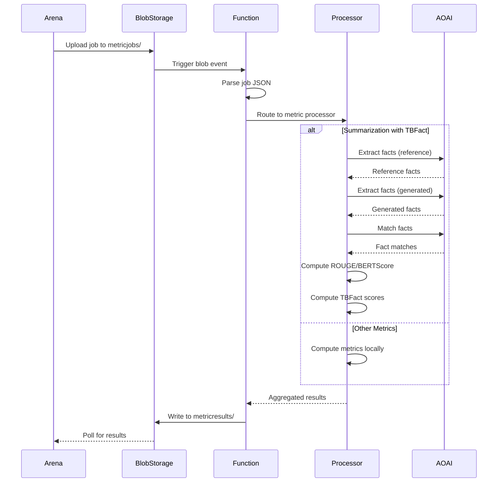

# Healthcare AI Model Evaluator Evaluation Engine

The Healthcare AI Model Evaluator Evaluation Engine is the Python-based backend service that handles metric computation, evaluation processing, and specialized assessment workflows for the Healthcare AI Model Evaluator platform.

## Overview

The Evaluation Engine operates as a set of Azure Function Apps that process evaluation jobs asynchronously through blob storage triggers. It provides:

- **Standard Metrics**: Text-based metrics for common evaluation tasks
- **Integrated TBFact**: Factual consistency evaluation built into summarization workflows
- **Extensible Architecture**: Support for custom metrics and specialized evaluators
- **Scalable Processing**: Event-driven architecture that scales with workload
- **Framework Integration**: Conversion utilities for external benchmarking tools

## Core Components

### 1. Blob Trigger System

The Engine uses Azure Functions blob triggers to automatically process evaluation jobs:

**Trigger Configuration**:
```python
@app.blob_trigger(
    arg_name="blob",
    path="metricjobs/{name}",
    connection="AzureWebJobsStorage"
)
```

**How It Works**:
1. Arena uploads JSON job file to `metricjobs/` container
2. Azure Storage notifies Function App of new blob
3. Function App reads blob content
4. Processes evaluation based on `metrics_type` field
5. Writes results to `metricresults/` container
6. Arena polls results container for completion

**Key Benefits**:
- Asynchronous processing (non-blocking for Arena)
- Automatic scaling based on queue depth
- Retry logic for transient failures
- Isolated failure handling per job

### 2. Metric Router

The router dispatches jobs to appropriate metric processors based on the `metrics_type` field:

**Supported Types**:
- `text_exact_match`: Exact string matching
- `image`: Image similarity metrics
- `summarization`: Text summarization evaluation (includes TBFact)

**Router Logic**:
```python
def route_metric_job(job_data: dict) -> dict:
    metrics_type = job_data.get("metrics_type")
    
    if metrics_type == "text_exact_match":
        return process_exact_match(job_data)
    elif metrics_type == "image":
        return process_image_metrics(job_data)
    elif metrics_type == "summarization":
        return process_summarization(job_data)
    else:
        raise ValueError(f"Unsupported metrics type: {metrics_type}")
```

### 3. Standard Metrics Processors

#### Text Exact Match

Performs exact string comparison between generated and reference outputs.

**Use Cases**:
- Multiple choice questions
- Classification tasks with fixed labels
- Binary yes/no questions

**Metrics Computed**:
- Exact match accuracy (case-sensitive)
- Case-insensitive accuracy
- Normalized accuracy (whitespace trimming)

**Example Output**:
```json
{
  "instance_id": "instance_1",
  "metrics": {
    "exact_match": true,
    "exact_match_case_insensitive": true,
    "exact_match_normalized": true
  }
}
```

#### Image Metrics

Computes similarity between generated and reference images using perceptual metrics.

**Use Cases**:
- Medical image generation validation
- Image segmentation evaluation
- Visual output comparison

**Metrics Computed**:
- Structural Similarity Index (SSIM)
- Peak Signal-to-Noise Ratio (PSNR)
- Mean Squared Error (MSE)

**Example Output**:
```json
{
  "instance_id": "instance_1",
  "metrics": {
    "ssim": 0.92,
    "psnr": 28.5,
    "mse": 0.0012
  }
}
```

#### Summarization Metrics

Comprehensive evaluation for text summarization tasks, including integrated TBFact factual consistency checking.

**Use Cases**:
- Clinical note summarization
- Radiology report generation
- Patient summary validation
- Medical literature summarization

**Metrics Computed**:
- **ROUGE** (Recall-Oriented Understudy for Gisting Evaluation):
  - ROUGE-1, ROUGE-2, ROUGE-L
  - Measures n-gram overlap with reference
- **BERTScore**:
  - Precision, Recall, F1
  - Semantic similarity using BERT embeddings
- **TBFact** (Integrated):
  - Factual consistency score
  - Precision, Recall, F1 for fact matching
  - Detailed fact-level evaluations

**Example Output**:
```json
{
  "instance_id": "instance_1",
  "metrics": {
    "rouge": {
      "rouge1": {"precision": 0.45, "recall": 0.52, "f1": 0.48},
      "rouge2": {"precision": 0.31, "recall": 0.38, "f1": 0.34},
      "rougeL": {"precision": 0.42, "recall": 0.49, "f1": 0.45}
    },
    "bertscore": {
      "precision": 0.88,
      "recall": 0.91,
      "f1": 0.89
    },
    "tbfact": {
      "score": 0.85,
      "precision": 0.80,
      "recall": 0.90,
      "f1": 0.85,
      "details": {
        "generated_facts": 10,
        "reference_facts": 12,
        "matched_facts": 9
      }
    }
  }
}
```

## TBFact Integration

TBFact (Tabulated Fact Verification) is integrated directly into the summarization metrics processor, providing factual consistency evaluation for medical text.

### How TBFact Works

TBFact evaluates factual consistency through a multi-stage process:

1. **Fact Extraction**:
   - Extracts atomic facts from reference text
   - Extracts atomic facts from generated summary
   - Uses NLP techniques to identify factual statements

2. **Fact Matching**:
   - Compares generated facts against reference facts
   - Uses semantic similarity for matching
   - Identifies hallucinations (facts in summary not in source)
   - Identifies omissions (important facts missing from summary)

3. **Scoring**:
   - **Precision**: Proportion of generated facts supported by reference
   - **Recall**: Proportion of reference facts covered in summary
   - **F1**: Harmonic mean of precision and recall

### Configuration

TBFact requires Azure OpenAI for fact extraction and matching:

**Environment Variables**:
```bash
AZURE_OPENAI_ENDPOINT=https://your-service.openai.azure.com/
AZURE_OPENAI_API_KEY=your-api-key
AZURE_OPENAI_DEPLOYMENT=gpt-4  # Model for fact extraction
```

**Resource Requirements**:
- GPT-4 or GPT-4-turbo deployment
- Sufficient quota for batch processing
- Recommended: Dedicated deployment for evaluation workloads

### Limitations

- **Language**: Currently optimized for English medical text
- **Domain**: Best performance on clinical narratives and reports
- **Latency**: Slower than lexical metrics due to LLM calls
- **Cost**: Incurs Azure OpenAI token usage costs

## Data Schema

### Input Schema

The Engine expects evaluation jobs in the following format:

```json
{
  "model_run": {
    "dataset": {
      "instances": [
        {
          "id": "instance_1",
          "input": {
            "text": "Input text or prompt...",
            "image": "data:image/jpeg;base64,..." 
          },
          "references": [
            {
              "output": {
                "text": "Reference/ground truth text...",
                "image": "data:image/jpeg;base64,..."
              }
            }
          ]
        }
      ]
    },
    "results": [
      {
        "completions": {
          "text": "Generated output text...",
          "image": "data:image/jpeg;base64,..."
        }
      }
    ]
  },
  "metrics_type": "summarization"
}
```

**Key Fields**:
- `model_run.dataset.instances`: Array of test cases with inputs and references
- `model_run.results`: Array of model-generated outputs (same order as instances)
- `metrics_type`: Determines which metric processor to use
- `input`/`output`/`completions`: Support both text and image (base64-encoded)

### Output Schema

The Engine writes results in the following format:

```json
{
  "timestamp": "2024-11-17T12:00:00Z",
  "request_id": "job-name.json",
  "evaluation_type": "metrics",
  "metrics_type": "summarization",
  "total_evaluations": 5,
  "results": [
    {
      "instance_id": "instance_1",
      "metrics": {
        "rouge": {...},
        "bertscore": {...},
        "tbfact": {...}
      }
    }
  ],
  "summary": {
    "average_rouge1_f1": 0.48,
    "average_bertscore_f1": 0.89,
    "average_tbfact_f1": 0.85
  }
}
```

**Result File Naming**:
- Input: `metricjobs/{job-name}.json`
- Output: `metricresults/{job-name}-results.json`

## Storage Architecture

### Blob Container Organization

The Engine uses dedicated blob containers for job isolation and organized result management:

**Main Metrics Containers**:
- `metricjobs/` - Input jobs for standard metrics processor
- `metricresults/` - Output results from standard metrics processor

**Evaluator Add-on Containers**:
- `evaluatorjobs/` - Input jobs for custom evaluator add-ons
- `evaluatorresults/` - Output results from custom evaluator add-ons

**Application Containers**:
- `images` - General image storage
- `reports` - Generated reports

**Naming Conventions**:
- **Main Metrics Results**: `{job-name}-results.json`
- **Add-on Results**: `{job-name}-{addon-name}-results.json`

The add-on naming pattern allows Arena to:
1. Discover all results for a given job by prefix matching
2. Identify which add-on produced each result
3. Aggregate results from multiple add-ons
4. Handle partial failures gracefully (some add-ons may fail while others succeed)

**Example**:
```
Input Job: evaluatorjobs/patient-summary-eval-001.json

Results:
- evaluatorresults/patient-summary-eval-001-summary-evaluator-results.json
- evaluatorresults/patient-summary-eval-001-clinical-accuracy-results.json
- evaluatorresults/patient-summary-eval-001-compliance-checker-results.json
```

### Container Access Patterns

**Write Once, Read Many (WORM)**:
- Jobs written once to input containers
- Results written once to output containers
- No modifications after write (immutable)

**Lifecycle Management**:
- Older jobs/results can be archived to cool/archive tier
- Retention policies can be configured per container
- Failed jobs moved to poison queue after max retries

## Processing Pipeline

### End-to-End Flow



### Error Handling

The Engine implements comprehensive error handling:

**Retry Logic**:
- Automatic retries for transient Azure OpenAI errors
- Exponential backoff for rate limiting
- Maximum retry attempts configurable

**Partial Failures**:
- Process all instances even if some fail
- Failed instances marked with error details
- Summary includes success/failure counts

**Dead Letter Queue**:
- Failed jobs after max retries moved to poison queue
- Manual intervention required for poison queue items
- Error logs captured in Application Insights

**Example Error Output**:
```json
{
  "instance_id": "instance_1",
  "error": "Azure OpenAI quota exceeded",
  "error_type": "RateLimitError",
  "metrics": null
}
```

## Local Development

### Prerequisites

**Required Software**:
- Python 3.11 or later
- Azure Functions Core Tools
- Azure Storage Emulator (Azurite)

**Setup Steps**:

1. **Install dependencies**:
   ```bash
   cd functions
   pip install -r pre-requirements.txt
   pip install -r requirements.txt
   ```

2. **Configure environment**:
   ```bash
   cp local.settings.json.example local.settings.json
   # Edit local.settings.json with your credentials
   ```

3. **Start Azurite**:
   ```bash
   # From project root
   docker compose up -d azurite
   ```

4. **Run functions locally**:
   ```bash
   cd functions
   func start
   ```

### Testing Locally

**Upload Test Job**:
```bash
# Using Azure CLI
az storage blob upload \
  --account-name devstoreaccount1 \
  --container-name metricjobs \
  --name test-job.json \
  --file sample-job.json \
  --connection-string "UseDevelopmentStorage=true"
```

**Monitor Logs**:
- Function output appears in terminal
- Check Azurite for blob operations
- Use Azure Storage Explorer for visual inspection

**Retrieve Results**:
```bash
az storage blob download \
  --account-name devstoreaccount1 \
  --container-name metricresults \
  --name test-job-results.json \
  --file results.json \
  --connection-string "UseDevelopmentStorage=true"
```

## Performance Optimization

### Parallelization

The Engine supports parallel processing at multiple levels:

**Instance-Level Parallelization**:
- Each dataset instance processed independently
- Python multiprocessing for CPU-bound metrics
- Configurable worker pool size

**Batch Processing**:
- Azure OpenAI batch API for fact extraction
- Reduces latency for large evaluation jobs
- Cost-effective for high-volume workloads

**Function Scaling**:
- Multiple function instances process jobs concurrently
- Azure manages instance allocation automatically
- No code changes required for scaling

### Caching Strategies

**Reference Fact Caching**:
- Reference facts cached across multiple evaluations
- Reduces redundant LLM calls
- Azure Blob Storage used for cache persistence

**Model Output Caching**:
- BERTScore embeddings cached per model
- Significantly speeds up repeated evaluations
- Cache invalidation on model changes

**Configuration**:
```bash
# Enable caching
ENABLE_FACT_CACHE=true
CACHE_CONTAINER=metric-cache
```

### Cost Optimization

**Reduce Azure OpenAI Costs**:
- Use cached facts for repeated reference texts
- Batch API for lower per-token pricing
- Consider GPT-3.5-turbo for less critical evaluations

**Optimize Function Execution**:
- Use dedicated App Service Plan for predictable costs
- Configure timeout to prevent runaway executions
- Monitor and alert on excessive token usage

**Storage Optimization**:
- Lifecycle policies to archive old jobs/results
- Compress results before writing to blob
- Delete temporary processing artifacts

## Monitoring and Debugging

### Application Insights Integration

**Metrics Tracked**:
- Function execution duration
- Success/failure rates
- Azure OpenAI API latency
- Blob storage operation times
- Memory and CPU usage

**Custom Events**:
```python
from applicationinsights import TelemetryClient

telemetry = TelemetryClient(instrumentation_key)
telemetry.track_event('MetricComputed', {
    'metric_type': 'tbfact',
    'instance_id': instance_id,
    'duration_ms': duration
})
```

### Logging Best Practices

**Structured Logging**:
```python
import logging
import json

logger = logging.getLogger(__name__)

logger.info(json.dumps({
    "event": "metric_computation_started",
    "request_id": request_id,
    "metrics_type": metrics_type,
    "instance_count": len(instances)
}))
```

**Correlation IDs**:
- Each job assigned unique correlation ID
- ID propagated through all processing steps
- Enables end-to-end request tracing

**Log Levels**:
- `ERROR`: Processing failures, API errors
- `WARNING`: Retries, partial failures, quota warnings
- `INFO`: Job start/completion, major milestones
- `DEBUG`: Detailed processing steps (disabled in production)

### Health Monitoring

**Health Check Endpoint**:
```python
@app.function_name(name="health")
@app.route(route="health", methods=["GET"])
def health_check(req: func.HttpRequest) -> func.HttpResponse:
    # Check dependencies
    storage_ok = check_storage_connection()
    openai_ok = check_openai_connection()
    
    if storage_ok and openai_ok:
        return func.HttpResponse("Healthy", status_code=200)
    else:
        return func.HttpResponse("Unhealthy", status_code=503)
```

**Dependency Checks**:
- Azure Storage connectivity
- Azure OpenAI API availability
- Configuration validation
- External service health

## External Framework Integration

### MedHelm Conversion

The Engine includes utilities to convert MedHelm benchmark data into Healthcare AI Model Evaluator format.

**Conversion Notebooks**:
- `functions/notebooks/medhelm_llm_evaluator.ipynb`: Convert MedHelm datasets
- `functions/notebooks/medhelm_metrics_transform.ipynb`: Convert MedHelm metrics

**Use Cases**:
- Import Stanford CRFM clinical task taxonomy
- Leverage existing MedHelm benchmarks
- Compare models against MedHelm baselines
- Extend MedHelm with custom validation workflows

**Example Workflow**:
1. Download MedHelm dataset
2. Run conversion notebook
3. Upload converted JSONL to Arena
4. Run evaluation with Healthcare AI Model Evaluator metrics
5. Add human validation layer
6. Export refined dataset

### Future Integrations

**Planned Support**:
- MedEvals framework integration
- HELM (Holistic Evaluation of Language Models) compatibility
- Custom benchmark import utilities

## Troubleshooting

### Common Issues

**Issue: Blob trigger not firing**
- Verify storage connection string in function app settings
- Check blob container exists (`metricjobs`)
- Confirm function app has storage account access
- Review function app logs for trigger errors

**Issue: Azure OpenAI quota exceeded**
- Check deployment quota in Azure OpenAI portal
- Implement request throttling in code
- Consider dedicated deployment for evaluations
- Monitor token usage via Application Insights

**Issue: Out of memory errors**
- Reduce batch size for large datasets
- Process instances sequentially instead of parallel
- Use streaming for large blob reads
- Upgrade function app plan if needed

**Issue: Results not appearing**
- Verify output container name (`metricresults`)
- Check function app has write permissions to storage
- Review function logs for blob write errors
- Ensure result file naming matches expected pattern

### Debug Tools

**Local Debugging**:
```bash
# Enable verbose logging
func start --verbose

# Attach debugger (VS Code)
# Set breakpoints in metric processors
# Upload test blob to trigger function
```

**Remote Debugging**:
```bash
# Stream function app logs
func azure functionapp logstream <app-name> --browser

# Download function execution logs
az functionapp log download \
  --resource-group <rg> \
  --name <app-name>
```

## Best Practices

### Development

- Test metric implementations with diverse inputs
- Handle edge cases (empty strings, null values, malformed data)
- Add comprehensive error messages for debugging
- Use type hints and validation (Pydantic models)
- Write unit tests for each metric processor

### Deployment

- Deploy to dedicated resource group per environment
- Use managed identity for Azure service access
- Configure appropriate timeout values per metric type
- Set up Application Insights for all function apps
- Enable diagnostic logging for troubleshooting

### Operations

- Monitor Azure OpenAI quota usage regularly
- Set up alerts for function failures
- Review cost reports monthly
- Archive old job/result blobs periodically
- Keep dependencies updated (security patches)

## See Also

- [Custom Evaluation Add-ons](custom_evaluation_addons.md) - Building custom evaluators
- [Functions README](../functions/README.md) - Engine setup and configuration
- [Project Overview](project_overview.md) - Platform overview
