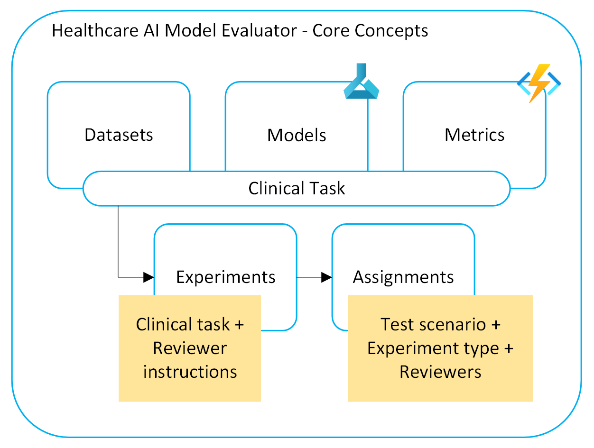
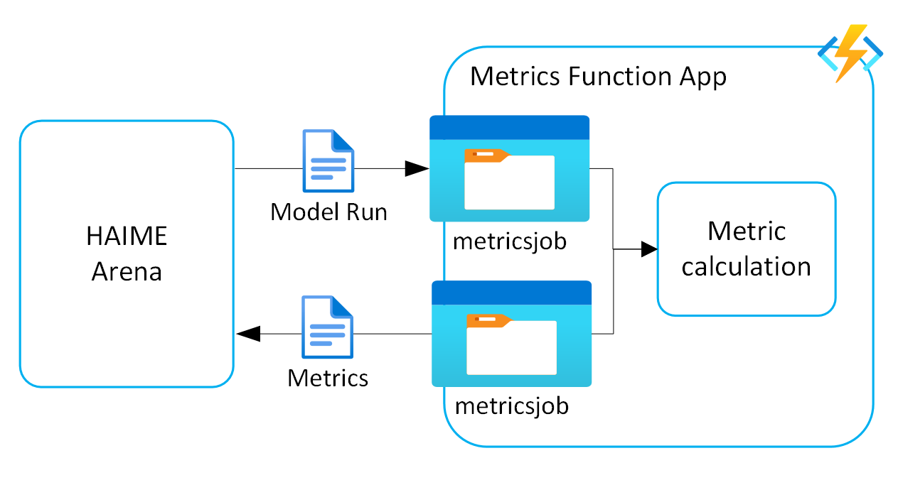

# Healthcare AI Model Evaluator Project Overview

Healthcare AI Model Evaluator is a comprehensive medical AI model benchmarking platform consisting of two primary components that work together to provide evaluation, validation, and comparison capabilities for healthcare AI models.

## System Components

Healthcare AI Model Evaluator consists of two main architectural components:

### 1. Healthcare AI Model Evaluator Arena

The Arena is the user-facing interface and orchestration layer that enables medical professionals and data scientists to manage evaluation workflows.



**Technology Stack**:
- **Backend**: .NET 8 Web API
- **Frontend**: React 18 with TypeScript
- **Database**: Azure Cosmos DB (MongoDB API, serverless)
- **Storage**: Azure Blob Storage
- **Authentication**: Azure AD integration via MSAL

**Core Capabilities**:
- Dataset management (private and public datasets)
- Model registration and configuration
- Clinical task creation for human validation workflows
- Experiment design (A/B testing, simple evaluation, Arena comparison)
- Model connector framework for inference integration
- Built-in Model-as-judge integration
- Results aggregation and visualization
- Export capabilities for refined datasets

### 2. Healthcare AI Model Evaluator Engine

The Engine is the Python-based evaluation backend that handles metric computation and specialized evaluation workflows.



**Technology Stack**:
- **Runtime**: Azure Functions (Python 3.11)
- **Triggers**: Blob storage events
- **AI Services**: Azure OpenAI for LLM-based evaluation
- **Processing**: Asynchronous, event-driven architecture

**Core Capabilities**:
- Standard metrics computation (exact match, ROUGE, BERTScore)
- Integrated factual consistency evaluation (TBFact)
- Model-as-judge evaluation via add-ons
- External framework integration (MedHelm conversion utilities)
- Extensible add-on architecture for custom evaluators

## Design Principles

1. **Separation of Concerns**: Clean separation between evaluation logic and Arena integration
2. **Modularity**: Evaluators can be developed as standalone modules
3. **Transparency**: All intermediate steps exposed for human validation
4. **Standards Compliance**: Compatible with external evaluation frameworks
5. **Medical Focus**: Designed specifically for healthcare evaluation workflows

## What Makes Healthcare AI Model Evaluator Unique

1. **Medical Professional-Focused Interface**: Healthcare AI Model Evaluator provides Arena's intuitive, low-code interface that enables medical professionals to interact with evaluation workflows without requiring deep technical expertise, complementing developer-focused tools in the ecosystem.

2. **Human-in-the-Loop Validation**: Emphasis on medical expert validation of model outputs, allowing clinicians to:
   - Validate model outputs using various scales (binary, Likert, detailed)
   - Review and correct AI-generated evaluations
   - Create tailored ground truth datasets based on clinical expertise
   - Build upon existing benchmarks with expert-validated refinements

3. **Ecosystem Integration with Enhanced User Experience**: While leveraging the comprehensive evaluation capabilities of tools like MedHelm and MedEvals, Healthcare AI Model Evaluator adds value through:
   - **Low-code workflows** for medical professionals
   - **Built-in expert review processes** for validation workflows
   - **Direct control** over evaluation methodology and customization
   - **Seamless data exchange** with external frameworks while maintaining workflow control

4. **Intermediate Step Transparency**: Custom evaluators expose all intermediate computation steps for human review, enabling validation of the evaluation process itself - a unique capability that enhances trust in automated metrics.

5. **Flexible Ecosystem Integration**: Designed to work alongside and enhance existing medical AI evaluation tools by:
   - Converting and importing data from external benchmarks (MedHelm, MedEvals)
   - Providing enhanced UI workflows for expert validation
   - Enabling custom metric development with transparent intermediate steps
   - Supporting export of refined datasets back to the broader ecosystem

## Integration with Broader Ecosystem

### Relationship with External Tools

**MedHelm (Stanford CRFM):**
- **Purpose**: Comprehensive medical LLM evaluation benchmark with 121 clinical tasks
- **Integration**: Healthcare AI Model Evaluator includes notebooks to convert MedHelm datasets, model outputs, and metrics into Arena-compatible format
- **Benefits**: Leverages Stanford's extensive clinical task taxonomy while maintaining Healthcare AI Model Evaluator's UI advantages

```
External Tools (MedHelm, MedEvals)
    ↓ (via conversion notebooks)
Healthcare AI Model Evaluator Arena Platform (.NET + React)
    ↓ (human validation)
Refined Datasets & Models
```

**Microsoft Azure Foundry Model Catalogue:**
- **Purpose**: Azure Foundry as a provider of models.
- **Integration**: Arena directly connects to models deployed through the Model Catalogue.
- **Benefits**: Leverages a growing catalogue of models.

## Technical Architecture

### Data Schema
Healthcare AI Model Evaluator implements a standardized data schema shared between the Python engine and Arena:
- **ModelRun**: Represents a complete model evaluation session
- **Instance**: Individual test cases with inputs and references
- **ModelOutput**: Generated predictions with metadata
- **Dataset**: Collections of instances for evaluation

### Evaluation Patterns

1. **Built-in Metrics**:
    - Standard text metrics (exact match, ROUGE, BERTScore)
    - Domain-specific metrics like TBFact for factual consistency
3. **Model-as-Judge**: LLM-based evaluation for subjective metrics and complex use-cases
4. **Human Validation**: Expert review and correction workflows

## Key Workflows

### 1. Standard Benchmarking Workflow
1. **Setup**: Data scientists deploy Healthcare AI Model Evaluator Arena, upload datasets and connect models
2. **Evaluation**: Automated benchmark runs using existing models
3. **Validation**: Arena Admin creates clinical validation tasks
4. **Expert Review**: Medical professionals validate outputs through Arena UI
5. **Decision Making**:
   - Export validation data for model fine-tuning
   - Select optimal models based on combined automated and human metrics

### 2. Custom Metric and Model-as-a-judge Development
1. **Implementation**: Build evaluator (e.g., TBFact, or LLM-Jury)
2. **Deployment**: Deploy as separate Azure service
    - Model connectors support Model Catalogue deployments, Azure Machine Learning endpoints
    <!-- and Azure Function Apps. -->
3. **Usage**:
    - Models can act as evaluators for Arena experiments
    <!-- - Human experts can validate outputs of evaluator that use Healthcare AI Model Evaluator data objects.  -->

## Getting Started

For detailed setup instructions, see:
- [Deployment Guide](../DEPLOYMENT.md) - Complete deployment instructions
- [Custom Evaluation Add-on](./custom_evaluation_addons.md) - Creating custom evaluators
- [Add-ons Documentation](../addons/README.md) - Available extensions

## Contributing

Healthcare AI Model Evaluator is designed to be extensible and welcomes contributions in:
- Custom medical evaluators and metrics
- Integration with additional external frameworks
- UI/UX improvements for medical professional workflows
- Documentation and examples

For contribution guidelines and development setup, see the [CONTRIBUTING.md](CONTRIBUTING.md).
