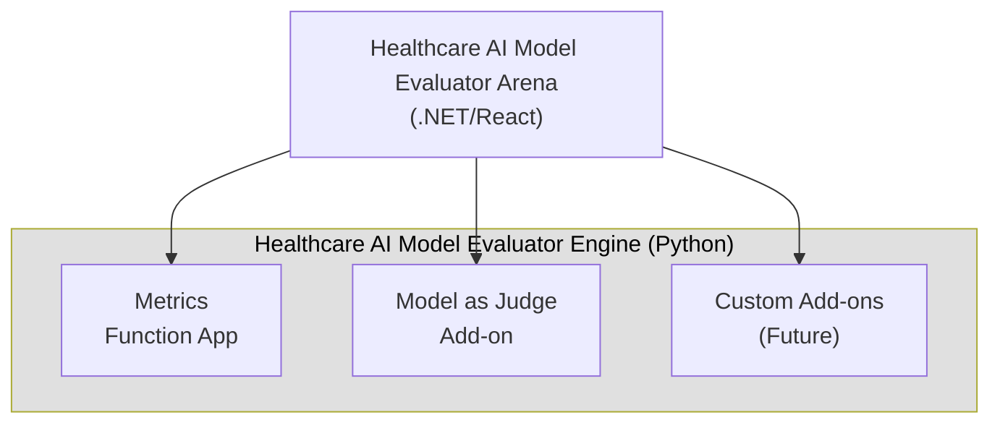

# Healthcare AI Model Evaluator Project Overview

Healthcare AI Model Evaluator is a comprehensive medical AI model benchmarking tool designed to facilitate evaluation of healthcare models on arbitrary datasets. Healthcare AI Model Evaluator consists of two main components working together:

### 1. Healthcare AI Model Evaluator Arena
- **Technology**: .NET backend with React frontend
- **Purpose**: User-friendly interface for medical professionals and data scientists
- **Key Features**:
  - Dataset upload and management (private and public datasets)
  - Clinical task creation for human validation workflows
  - Model validation functionality (A/B testing, thumbs up/down, Likert scale, full validation)
  - Model connectors for inference and evaluation
  - Metric collection and visualization

### 2. Healthcare AI Model Evaluator Engine
- **Technology**: Python-based evaluation engine
- **Purpose**: Custom metrics computation and model evaluation backend
- **Key Features**:
  - Standardized data schema compatible with Arena
  - Custom evaluator implementations (model-as-judge)
  - Advanced metrics computation including integrated TBFact factual consistency evaluation
  - Azure Function Apps for scalable metric computation
  - Integration with external evaluation frameworks

### Design Principles

1. **Separation of Concerns**: Clean separation between evaluation logic and Arena integration
2. **Modularity**: Evaluators can be developed as standalone modules
3. **Transparency**: All intermediate steps exposed for human validation
4. **Standards Compliance**: Compatible with external evaluation frameworks
5. **Medical Focus**: Designed specifically for healthcare evaluation workflows

## What Makes Healthcare AI Model Evaluator Unique

1. **Medical Professional-Focused Interface**: Healthcare AI Model Evaluator provides Arena's intuitive, low-code interface that enables medical professionals to interact with evaluation workflows without requiring deep technical expertise, complementing developer-focused tools in the ecosystem.

2. **Human-in-the-Loop Validation**: Emphasis on medical expert validation of model outputs, allowing clinicians to:
   - Validate model outputs using various scales (binary, Likert, detailed)
   - Review and correct AI-generated evaluations
   - Create tailored ground truth datasets based on clinical expertise
   - Build upon existing benchmarks with expert-validated refinements

3. **Ecosystem Integration with Enhanced User Experience**: While leveraging the comprehensive evaluation capabilities of tools like MedHelm and MedEvals, Healthcare AI Model Evaluator adds value through:
   - **Low-code workflows** for medical professionals
   - **Built-in expert review processes** for validation workflows
   - **Direct control** over evaluation methodology and customization
   - **Seamless data exchange** with external frameworks while maintaining workflow control

4. **Intermediate Step Transparency**: Custom evaluators expose all intermediate computation steps for human review, enabling validation of the evaluation process itself - a unique capability that enhances trust in automated metrics.

5. **Flexible Ecosystem Integration**: Designed to work alongside and enhance existing medical AI evaluation tools by:
   - Converting and importing data from external benchmarks (MedHelm, MedEvals)
   - Providing enhanced UI workflows for expert validation
   - Enabling custom metric development with transparent intermediate steps
   - Supporting export of refined datasets back to the broader ecosystem

## Integration with Broader Ecosystem

### Relationship with External Tools

**MedHelm (Stanford CRFM):**
- **Purpose**: Comprehensive medical LLM evaluation benchmark with 121 clinical tasks
- **Integration**: Healthcare AI Model Evaluator includes notebooks to convert MedHelm datasets, model outputs, and metrics into Arena-compatible format
- **Benefits**: Leverages Stanford's extensive clinical task taxonomy while maintaining Healthcare AI Model Evaluator's UI advantages

```
External Tools (MedHelm, MedEvals)
    ↓ (via conversion notebooks)
Healthcare AI Model Evaluator Arena Platform (.NET + React)
    ↓ (human validation)
Refined Datasets & Models
```

**AI Foundry Model Catalogue (Microsoft):**
- **Purpose**: Azure AI Foundry as a provider of models.
- **Integration**: Arena directly connects to models deployed through the Model Catalogue.
- **Benefits**: Leverages a growing catalogue of models.

## Technical Architecture

### Data Schema
Healthcare AI Model Evaluator implements a standardized data schema shared between the Python engine and Arena:
- **ModelRun**: Represents a complete model evaluation session
- **Instance**: Individual test cases with inputs and references
- **ModelOutput**: Generated predictions with metadata
- **Dataset**: Collections of instances for evaluation

### Evaluation Patterns

1. **Built-in Metrics**:
    - Standard text metrics (exact match, ROUGE, BERTScore)
    - Domain-specific metrics like TBFact for factual consistency
3. **Model-as-Judge**: LLM-based evaluation for subjective metrics and complex use-cases
4. **Human Validation**: Expert review and correction workflows

### Deployment Architecture



## Key Workflows

### 1. Standard Benchmarking Workflow
1. **Setup**: Data scientists deploy Healthcare AI Model Evaluator Arena, upload datasets and connect models
2. **Evaluation**: Automated benchmark runs using existing models
3. **Validation**: Arena Admin creates clinical validation tasks
4. **Expert Review**: Medical professionals validate outputs through Arena UI
5. **Decision Making**:
   - Export validation data for model fine-tuning
   - Select optimal models based on combined automated and human metrics

### 2. Custom Metric and Model-as-a-judge Development
1. **Implementation**: Build evaluator (e.g., TBFact, or LLM-Jury)
2. **Deployment**: Deploy as separate Azure service
    - Model connectors support Model Catalogue deployments, Azure Machine Learning endpoints
    <!-- and Azure Function Apps. -->
3. **Usage**:
    - Models can act as evaluators for Arena experiments
    <!-- - Human experts can validate outputs of evaluator that use Healthcare AI Model Evaluator data objects.  -->

## Future Roadmap

### Short-term (Current Release)
- ✅ Model-as-judge Azure ML deployment
- ✅ TBFact evaluator
- ✅ MedHelm data conversion capabilities
- 🎯 Metrics Function Apps with custom metric integration
- 🎯 Fine-tuning pipeline integration

### Medium-term
- Integration with Azure AI Foundry evaluators
- Expanded MedHelm compatibility
- Agent evaluation capabilities

### Long-term
- Advanced human-AI collaborative evaluation workflows
- Real-time evaluation capabilities for production deployments

## Getting Started

For detailed setup instructions, see:
- [Deployment Guide](DEPLOYMENT_GUIDE.md) - Complete deployment instructions
- [Developer Guide](DEVELOPER_GUIDE.md) - Development environment setup
- [Custom Components Guide](CUSTOM_COMPONENTS.md) - Creating custom evaluators
- [Add-ons Documentation](../addons/README.md) - Available extensions

## Contributing

Healthcare AI Model Evaluator is designed to be extensible and welcomes contributions in:
- Custom medical evaluators and metrics
- Integration with additional external frameworks
- UI/UX improvements for medical professional workflows
- Documentation and examples

For contribution guidelines and development setup, see the [Developer Guide](DEVELOPER_GUIDE.md).
