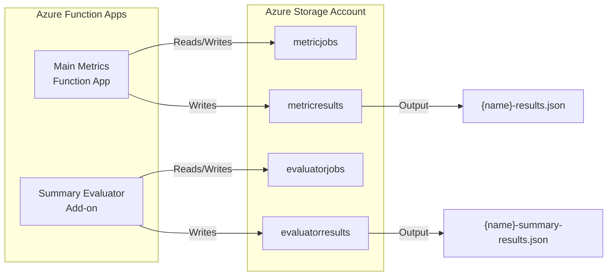

# Summary Evaluator Add-on

This add-on provides Model-as-a-Judge evaluation capabilities for Healthcare AI Model Evaluator, leveraging the core Healthcare AI Model Evaluator summary evaluation implementation for LLM-based assessment of medical texts.

## Overview

The Summary Evaluator add-on:
- Uses MedBench's `SummaryEvaluatorRunner` implementation
- Monitors the `evaluatorjobs/` container for evaluation requests (separate from main metrics)
- Only processes jobs where `metrics_type` is `"summarization"`
- Outputs results to `evaluatorresults/` with naming pattern `{name}-summary-results.json`
- Enables independent evaluation workflows alongside the main metrics function app and other add-ons
- Demonstrates custom addon pattern for specialized evaluators

## Architecture



## Input Format

The Summary Evaluator add-on expects the same input format as the main metrics function app:

```json
{
  "model_run": {
    "dataset": {
      "instances": [
        {
          "id": "instance_1",
          "references": [
            {
              "output": {
                "text": "Reference/ground truth text..."
              }
            }
          ]
        }
      ]
    },
    "results": [
      {
        "completions": {
          "text": "Generated text to evaluate..."
        }
      }
    ]
  },
  "metrics_type": "summarization"
}
```

**Key Points:**
- Only processes requests where `metrics_type` is `"summarization"`
- Extracts generated text from `model_run.results[].completions`
- Extracts reference text from corresponding `model_run.dataset.instances[].references`
- Uses `evaluatorjobs/` container (separate from main metrics `metricjobs/`)
- Skips jobs with other `metrics_type` values

## Deployment

### Prerequisites

1. **Azure Function App** - Create a new function app for the TBFact add-on
2. **Storage Account** - Same storage account used by the main metrics function app
3. **Azure OpenAI** - Access to Azure OpenAI service

### Environment Variables

Configure these environment variables in your Azure Function App:

```bash
# Azure OpenAI Configuration
AZURE_OPENAI_ENDPOINT=https://your-openai-service.openai.azure.com/
AZURE_OPENAI_API_KEY=your-api-key
AZURE_OPENAI_DEPLOYMENT=gpt-4  # Optional, defaults to 'gpt-4'

# Storage Configuration (same as main function app)
AzureWebJobsStorage=DefaultEndpointsProtocol=https;AccountName=...
```

### Option 1: Using the Deployment Script (Recommended)

1. **Run the deployment script**:
   ```bash
   cd addons/tbfact
   ./deploy_addon.sh
   ```

2. **Deploy the package**:
   ```bash
   # Using Azure CLI
   az functionapp deployment source config-zip \
     --resource-group your-resource-group \
     --name your-tbfact-function-app \
     --src ./build/tbfact-addon-package.zip
   ```

### Option 2: Using Azure Functions Core Tools

1. **Package manually**:
   ```bash
   # Create deployment directory
   mkdir tbfact-deployment
   cd tbfact-deployment
   
   # Copy addon files
   cp ../function_app.py .
   cp ../host.json .
   cp ../requirements.txt .
   
   # Copy MedBench package
   cp -r ../../medbench .
   ```

2. **Deploy**:
   ```bash
   func azure functionapp publish your-tbfact-function-app
   ```

### Option 3: VS Code Azure Functions Extension

1. Run the deployment script to create the package
2. Open the `build/tbfact-addon-package` folder in VS Code
3. Use the Azure Functions extension to deploy

## Usage

### 1. Upload Evaluation Job

Upload a job file to the `metricjobs/` container:

```bash
az storage blob upload \
  --account-name your-storage-account \
  --container-name metricjobs \
  --name evaluation-job.json \
  --file your-model-run-data.json
```

### 2. Monitor Processing

Both the main metrics function app and TBFact add-on will process the file:
- Main function app outputs: `metricresults/evaluation-job-results.json`
- TBFact add-on outputs: `metricresults/evaluation-job-tbfact-results.json`

### 3. Retrieve Results

```bash
# Download TBFact results
az storage blob download \
  --account-name your-storage-account \
  --container-name metricresults \
  --name evaluation-job-tbfact-results.json \
  --file tbfact-results.json
```

## Output Format

TBFact results include detailed evaluation metrics:

```json
{
  "timestamp": "2024-06-03T12:00:00Z",
  "request_id": "evaluation-job.json",
  "evaluation_type": "tbfact",
  "metrics_type": "summarization",
  "total_evaluations": 2,
  "results": [
    {
      "instance_id": "instance_1",
      "evaluation": {
        "score": 0.85,
        "explanation": "Precision: 0.80, Recall: 0.90, F1: 0.85",
        "details": {
          "metrics": {
            "precision": 0.80,
            "recall": 0.90,
            "f1": 0.85
          },
          "generated_facts": [...],
          "reference_facts": [...],
          "fact_evaluations": [...]
        }
      }
    }
  ]
}
```

## Development

### Local Development

1. **Install dependencies**:
   ```bash
   pip install -r requirements.txt
   ```

2. **Set up local settings**:
   ```bash
   cp local.settings.json.example local.settings.json
   # Edit with your Azure OpenAI credentials
   ```

3. **Start local development**:
   ```bash
   func start
   ```

### Testing

Test the function locally by uploading files to the local Azurite storage emulator or using the HTTP trigger for health checks:

```bash
curl http://localhost:7071/api/health
```

## Migration Path

This addon is designed with future package evolution in mind:

1. **Current State**: MedBench package is bundled with the addon
2. **Future State**: When MedBench becomes a PyPI package, the addon can be simplified to:
   ```txt
   # requirements.txt
   azure-functions
   medbench>=1.0.0  # Install from PyPI
   ```

The deployment script and core functionality are designed to work with minimal changes when this transition occurs.

## Troubleshooting

### Common Issues

1. **Function not triggering**: Check that `metricjobs` container exists and blob trigger is configured
2. **Azure OpenAI errors**: Verify environment variables and API key permissions
3. **Import errors**: Ensure MedBench package is included in deployment zip

### Debugging

Enable detailed logging in `local.settings.json`:

```json
{
  "Values": {
    "FUNCTIONS_WORKER_RUNTIME": "python",
    "AzureWebJobsFeatureFlags": "EnableWorkerIndexing",
    "logging__logLevel__default": "Information"
  }
}
```

### Health Check

Use the health check endpoint to verify deployment:

```bash
curl https://your-function-app.azurewebsites.net/api/health
```

## Contributing

When modifying the TBFact add-on:

1. Test changes locally with the development setup
2. Run the deployment script to ensure packaging works correctly
3. Update this README if deployment instructions change
4. Consider backward compatibility for existing deployments
